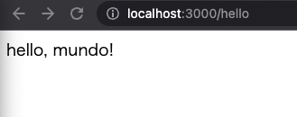
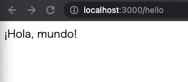
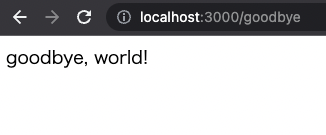
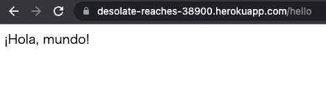

# 1.3.2

## 1
デフォルトのRailsページに表示されているものと比べて、今の自分のコンピュータにあるRubyのバージョンはいくつになっていますか? コマンドラインでruby -vを実行することで簡単に確認できます。
```shell
% docker-compose run --no-deps web ruby -v
ruby 2.7.6p219 (2022-04-12 revision c9c2245c0a) [aarch64-linux]
```

## 2
同様にして、Railsのバージョンも調べてみましょう。調べたバージョンはリスト 1.2でインストールしたバージョンと一致しているでしょうか?
```
% % docker-compose run --no-deps web rails -v
Rails 6.0.4
```

# 1.3.4

## 1
リスト 1.11のhelloアクションを書き換え、「hello, world!」の代わりに「hola, mundo!」と表示されるようにしてみましょう。


## 2
Railsでは「非ASCII文字」もサポートされています。「¡Hola, mundo!」にはスペイン語特有の逆さ感嘆符「¡」が含まれています（図 1.23）17 。「¡」文字をMacで表示するには、Optionキーを押しながら1キーを押します。この文字をコピーして自分のエディタに貼り付ける方が早いかもしれません。


## 3
リスト 1.11のhelloアクションを参考にして、２つ目のアクションgoodbyeを追加しましょう。このアクションは、「goodbye, world!」というテキストを表示します。リスト 1.13のルーティングを編集して、ルートルーティングの割り当て先をhelloアクションからgoodbyeアクションに変更します（図 1.24）。



# 1.5.3

## 1
1.3.4.1と同じ変更を行い、本番アプリでも「hola, mundo!」を表示できるようにしてください。


## 2
1.3.4.1と同様、ルートへのルーティングを変更してgoodbyeアクションの結果が表示されるようにしてください。またデプロイ時には、Git pushのmasterをあえて省略し、git push herokuでデプロイできることを確認してみてください。


# 1.5.4

## 1 
heroku helpコマンドを実行し、Herokuコマンドの一覧を表示してみてください。Herokuアプリのログを表示するコマンドはどれですか?

heroku logsでアプリのログを調べられる。
```shell
% heroku help
CLI to interact with Heroku

VERSION
  heroku/7.63.0 darwin-x64 node-v14.19.0

USAGE
  $ heroku [COMMAND]

TOPICS
  access          manage user access to apps
  addons          tools and services for developing, extending, and operating your app
(中略)
  run             run a one-off process inside a Heroku dyno
  sessions        OAuth sessions
  spaces          manage heroku private spaces
  webhooks        list webhooks on an app

COMMANDS
  access          list who has access to an app
  addons          lists your add-ons and attachments
(中略)
  logs            display recent log output
(中略)
  update          update the heroku CLI
  webhooks        list webhooks on an app
  which           show which plugin a command is in
```

## 2
上の演習で見つけたコマンドを使って、Herokuアプリの最近のログ（log）を調べてみましょう。直近に発生したイベントは何でしたか?（このログを調べるコマンドを覚えておくと、本番環境の不具合を見つけるときに役立ちます）
```shell
2022-09-11T09:58:25.868004+00:00 app[web.1]: I, [2022-09-11T09:58:25.867982 #4]  INFO -- : [5eaa9b9e-ec7a-4142-bf8c-f936d9462f7a]   Rendered html template (Duration: 0.0ms | Allocations: 2)
2022-09-11T09:58:25.868127+00:00 app[web.1]: I, [2022-09-11T09:58:25.868106 #4]  INFO -- : [5eaa9b9e-ec7a-4142-bf8c-f936d9462f7a] Completed 200 OK in 1ms (Views: 0.3ms | Allocations: 232)
2022-09-11T09:58:25.868308+00:00 heroku[router]: at=info method=GET path="/goodbye" host=desolate-reaches-38900.herokuapp.com request_id=5eaa9b9e-ec7a-4142-bf8c-f936d9462f7a fwd="220.254.4.36" dyno=web.1 connect=0ms service=2ms status=200 bytes=514 protocol=https
```